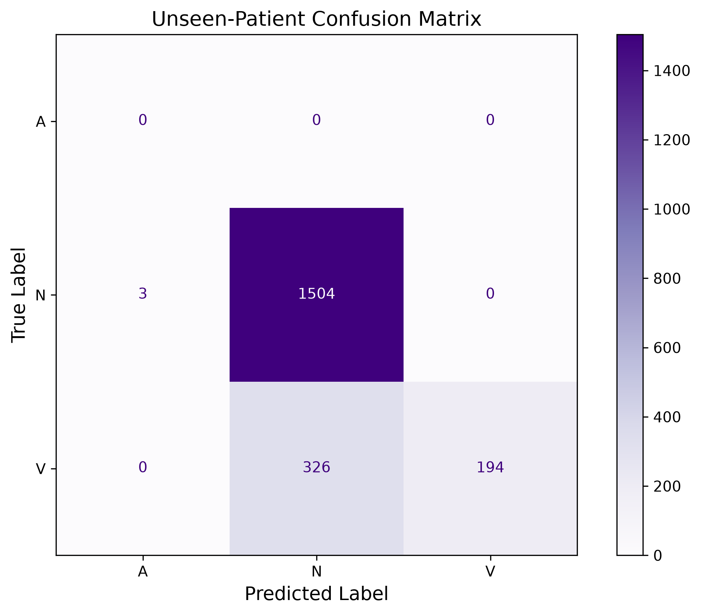
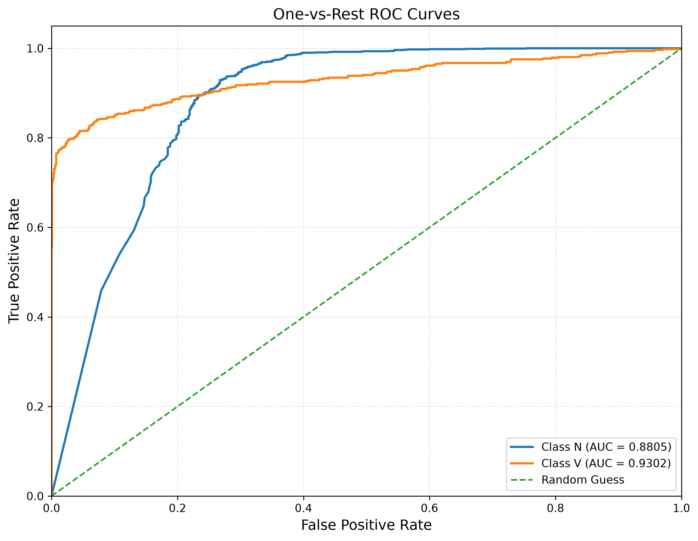

# ECG Arrhythmia Classification

Patient-independent ECG arrhythmia classification using a 1D Convolutional Neural Network, with explicit attention to data leakage, class imbalance, and model explainability.

Developed as part of undergraduate research at the **University of Thessaly** and presented at **IEEE CIBCB 2026**.

## Overview

Machine-learning models for ECG classification can achieve very high performance when beats from the same patient appear in both training and testing data. However, this may overestimate how well a model generalizes to previously unseen patients.

This project therefore uses a strict inter-patient evaluation protocol:

- Training patients: `100, 101, 102, 103, 104, 105, 115`
- Final test patient: `106`

Patient 106 is kept completely separate from model training and class balancing and is used only for final evaluation.

## Classification Task

The model is trained to distinguish three ECG beat classes:

| Label | Beat type |
|---|---|
| `N` | Normal beat |
| `A` | Atrial premature beat |
| `V` | Premature ventricular contraction |

The data are obtained from the **MIT-BIH Arrhythmia Database**.

## Pipeline

```text
MIT-BIH ECG Records
        │
        ▼
  Beat Extraction
        │
        ▼
Z-score Normalization
        │
        ▼
Train / Validation Split
        │
        ▼
SMOTE (Training Only)
        │
        ▼
     1D-CNN
        │
        ▼
Unseen Patient Evaluation
        │
        ▼
Metrics + ROC + Saliency
```

SMOTE is applied only after separating the validation subset, preventing synthetic samples from leaking into validation data.

The final test patient remains completely independent from both training and validation.

## Dataset

### Training patients

`100, 101, 102, 103, 104, 105, 115`

Training dataset:

- **11,004 ECG beats**
- `N`: 10,918
- `A`: 38
- `V`: 48

### Unseen test patient

`106`

Final test dataset:

- **2,027 ECG beats**
- `N`: 1,507
- `V`: 520

Each extracted ECG beat contains **200 samples**.

## Model

The classifier is implemented as a compact 1D Convolutional Neural Network.

Current implementation:

```text
Input (200 × 1)
    │
Conv1D (32 filters)
    │
MaxPooling1D
    │
Conv1D (64 filters)
    │
MaxPooling1D
    │
Flatten
    │
Dense (128)
    │
Dropout
    │
Softmax (3 classes)
```

Total trainable parameters: **396,035**.

## Reproduced Results

The current repository implementation was evaluated exclusively on unseen patient `106`.

| Metric | Result |
|---|---:|
| Accuracy | **83.77%** |
| Weighted F1-score | **0.810** |
| N precision | **0.822** |
| N recall | **0.998** |
| V precision | **1.000** |
| V recall | **0.373** |
| N ROC-AUC | **0.881** |
| V ROC-AUC | **0.930** |

### Evaluation Visualizations

#### Confusion Matrix



#### ROC Curves



### Confusion Matrix

For the two classes present in patient 106:

```text
              Predicted
              N      V
Actual N    1504      0
Actual V     326    194
```

Three normal beats were predicted as class `A`, which is absent from the test patient.

The model therefore demonstrates very high precision when identifying ventricular beats, but lower ventricular recall. This highlights an important limitation when generalizing from a severely imbalanced training population to an unseen patient.

Detailed reproduced metrics are available in:

```text
results/evaluation_metrics.json
results/classification_report.txt
```

## Explainability

The project includes gradient-based saliency analysis for ECG beats.

`src/saliency.py` calculates input gradients to examine which regions of an ECG beat most strongly influence the model's prediction.

This can also be used for failure analysis, including ventricular beats incorrectly classified as normal.

## Project Structure

```text
ecg-arrhythmia-classification/
├── README.md
├── requirements.txt
│
├── data/
│   └── README.md
│
├── docs/
├── models/
├── notebooks/
│
├── results/
│   ├── classification_report.txt
│   ├── evaluation_metrics.json
│   └── figures/
│
└── src/
    ├── __init__.py
    ├── data_preparation.py
    ├── model.py
    ├── train.py
    ├── evaluate.py
    └── saliency.py
```

## Technologies

- Python
- TensorFlow / Keras
- NumPy
- Pandas
- Scikit-learn
- Imbalanced-learn
- WFDB
- Matplotlib

## Reproducing the Experiment

Clone the repository:

```bash
git clone https://github.com/konstantinos-andris/ecg-arrhythmia-classification.git
cd ecg-arrhythmia-classification
```

Create a Python environment:

```bash
python3.12 -m venv .venv
source .venv/bin/activate
```

Install dependencies:

```bash
pip install -r requirements.txt
```

Prepare the MIT-BIH data:

```bash
python src/data_preparation.py
```

Train the model:

```bash
python src/train.py
```

Evaluate on unseen patient 106:

```bash
python src/evaluate.py
```

Generate a saliency analysis:

```bash
python src/saliency.py
```

The dataset is downloaded through the WFDB package and is excluded from version control.

## Research

This repository is associated with the research work:

**“Robust Arrhythmia Classification from ECG Signals Addressing Data Leakage and Minority Class Management”**

**K. Andris, E. Zarmpouni, K. Kolomvatsos**

Presented at the **IEEE Conference on Computational Intelligence in Bioinformatics and Computational Biology (CIBCB 2026)**, Athens, Greece.

Publication identifiers and the official IEEE Xplore link will be added once the proceedings become publicly available.

> **Note:** The metrics reported in this repository correspond to the current reproducible implementation. They should not be interpreted as a reproduction of every experimental configuration reported in the conference research.

## Author

**Konstantinos Andris**  
Undergraduate Student, Informatics & Telecommunications  
University of Thessaly

## License

The source code is currently provided for academic review and portfolio purposes.

No open-source license has been assigned yet.